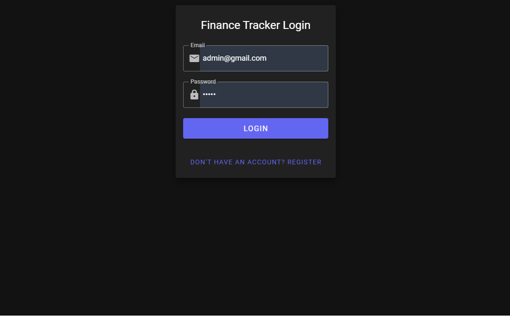
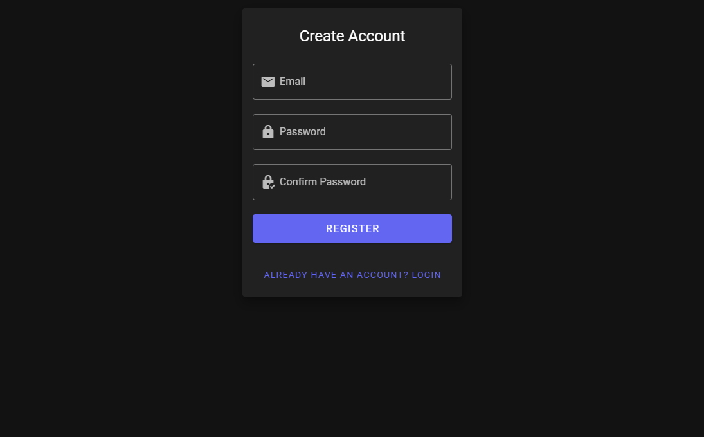
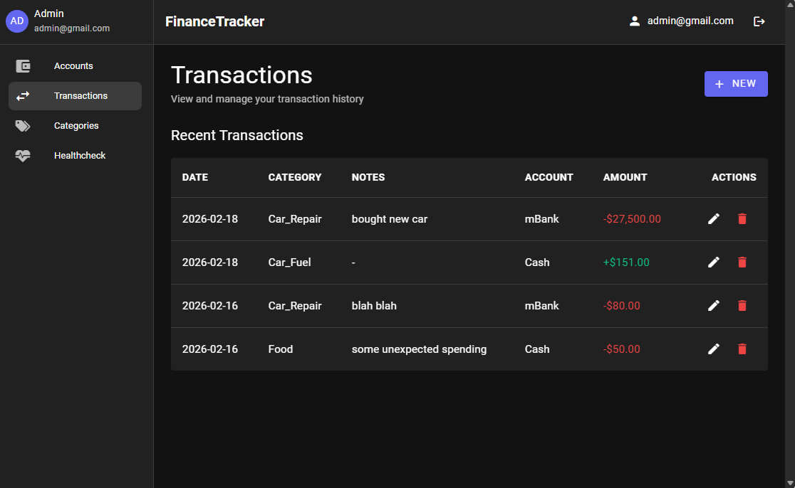
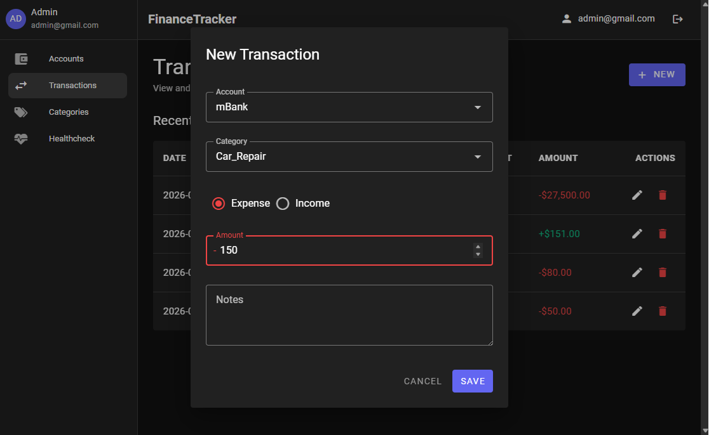
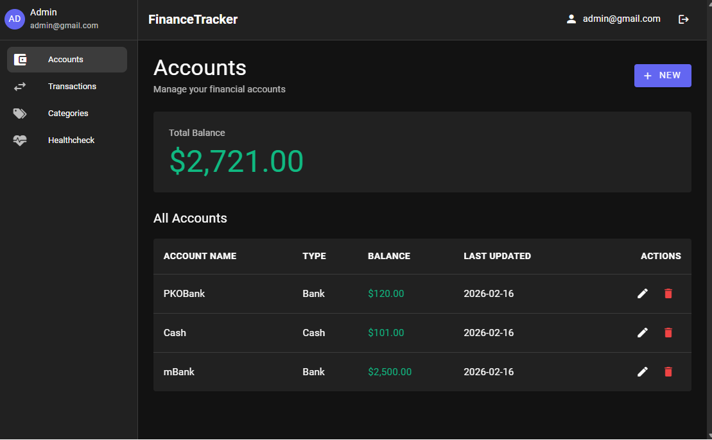
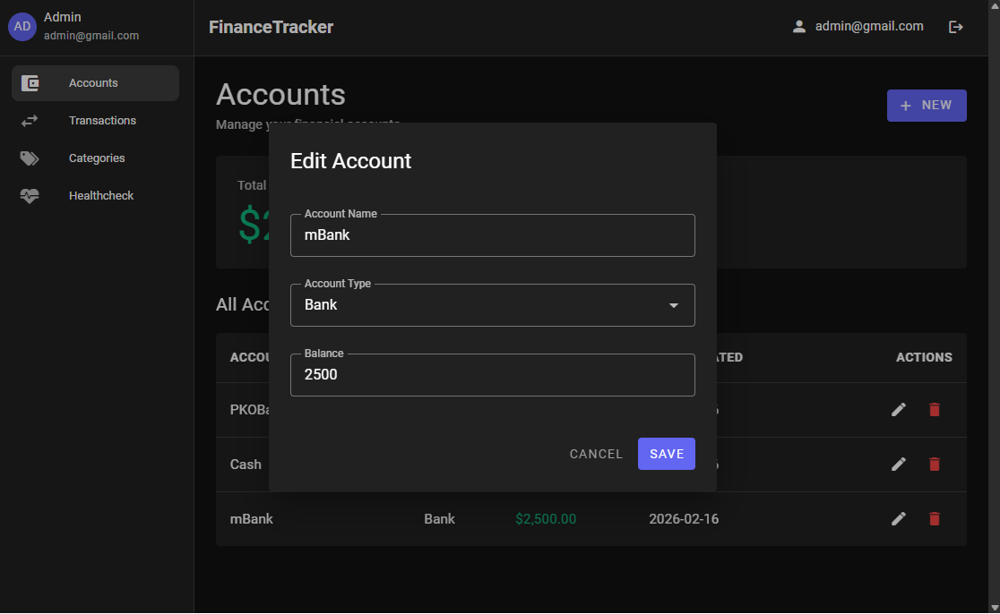
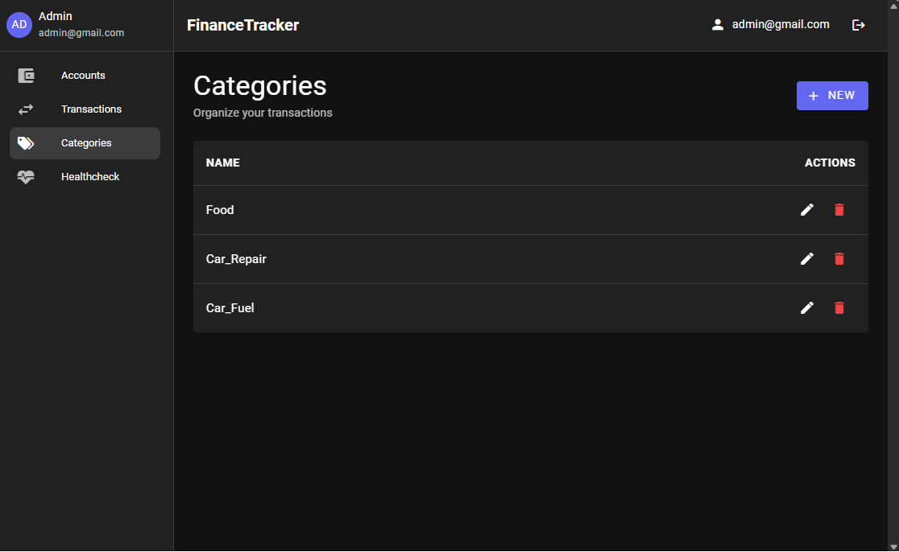
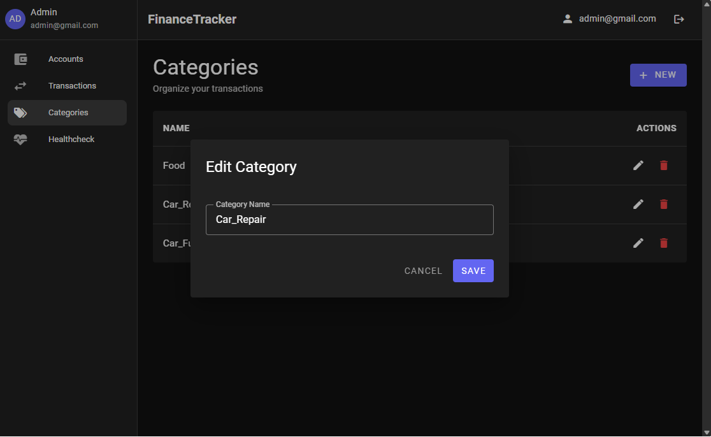
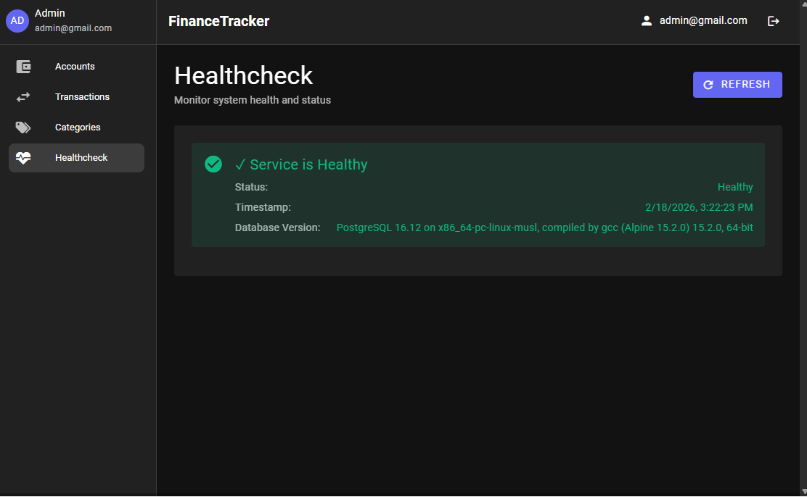

# Finance Tracker

A full-stack personal finance management application built with modern web technologies. Track your income, expenses, accounts, and gain insights into your financial health.


## 📋 Overview

Finance Tracker is a comprehensive financial management system that helps users monitor their transactions, manage multiple accounts (cash and bank), categorize expenses and income, and maintain a clear overview of their financial status. Built with clean architecture principles and modern development practices.

## 🛠️ Technology Stack

### Backend
- **.NET 9.0** - Modern, high-performance backend framework
- **ASP.NET Core Web API** - RESTful API architecture
- **Entity Framework Core 9.0** - ORM for database operations
- **PostgreSQL 16.12** - Robust relational database
- **JWT Authentication** - Secure token-based authentication
- **FluentValidation** - Request validation library
- **Swagger/OpenAPI** - API documentation
- **xUnit** - Unit testing framework
- **Moq** - Mocking framework for tests

### Frontend
- **Vue.js 3.4** - Progressive JavaScript framework
- **Vuetify 3.11** - Material Design component library
- **Vue Router 4.6** - Client-side routing
- **Vite 5.0** - Next-generation frontend build tool
- **Material Design Icons** - Icon library

### DevOps & Tools
- **Docker & Docker Compose** - Containerization
- **Playwright** - End-to-end testing
- **Git** - Version control
- **Nginx** - Reverse proxy for production

## 🏗️ Architecture

The application follows **Clean Architecture** and **Repository Pattern** principles:

```
┌─────────────────────────────────────────────────────────────┐
│                         Frontend                            │
│  Vue.js 3 + Vuetify (SPA with Vue Router)                  │
└─────────────────────────────────────────────────────────────┘
                            ↓ HTTP/REST
┌─────────────────────────────────────────────────────────────┐
│                      Backend API Layer                      │
├─────────────────────────────────────────────────────────────┤
│  Controllers (AuthController, AccountsController, etc.)     │
│  ↓                                                          │
│  Service Layer (Business Logic)                             │
│  ↓                                                          │
│  Repository Layer (Data Access)                             │
│  ↓                                                          │
│  Entity Framework Core (ORM)                                │
└─────────────────────────────────────────────────────────────┘
                            ↓
┌─────────────────────────────────────────────────────────────┐
│                   PostgreSQL Database                       │
└─────────────────────────────────────────────────────────────┘
```

### Project Structure
```
├── Backend/
│   ├── src/
│   │   ├── FinanceTracker.API/           # Web API controllers, validators
│   │   ├── FinanceTracker.Infrastructure/ # Repositories, services, data context
│   │   └── FinanceTracker.DB/            # Entity models
│   └── tests/
│       └── FinanceTracker.UnitTests/     # Unit and integration tests
├── Frontend/
│   ├── src/
│   │   ├── components/                   # Reusable Vue components
│   │   ├── views/                        # Page components
│   │   ├── services/                     # API service layer
│   │   └── router/                       # Route configurations
│   └── package.json
├── Docker/                                # Docker configuration files
├── e2e-tests/                            # Playwright end-to-end tests
└── Docs/                                 # Project documentation
```

## 🚀 Getting Started

### Prerequisites
- [.NET 9 SDK](https://dotnet.microsoft.com/download/dotnet/9.0)
- [Node.js 18+](https://nodejs.org/) and npm
- [PostgreSQL 16+](https://www.postgresql.org/download/) or [Docker](https://www.docker.com/)

### Option 1: Run with Docker (Recommended)

1. **Clone the repository**
   ```bash
   git clone https://github.com/uladzimir-sakovich-0/AIEducation.git
   cd AIEducation
   ```

2. **Start all services with Docker Compose**
   ```bash
   cd Docker
   docker-compose up -d
   ```

3. **Access the application**
   - Frontend: http://localhost:3000
   - Backend API: http://localhost:5270
   - API Documentation: http://localhost:5270/swagger

### Option 2: Run Locally

#### Backend Setup

1. **Navigate to backend directory**
   ```bash
   cd Backend/src/FinanceTracker.API
   ```

2. **Configure database connection**
   
   Update `appsettings.json` with your PostgreSQL credentials:
   ```json
   {
     "ConnectionStrings": {
       "DefaultConnection": "Host=localhost;Database=financetracker;Username=postgres;Password=yourpassword"
     },
     "Jwt": {
       "SecretKey": "your-secret-key-min-32-characters-long",
       "Issuer": "FinanceTrackerAPI",
       "Audience": "FinanceTrackerClient"
     }
   }
   ```

3. **Apply database migrations**
   ```bash
   dotnet ef database update
   ```

4. **Run the backend**
   ```bash
   dotnet run
   ```
   
   Backend will be available at http://localhost:5270

#### Frontend Setup

1. **Navigate to frontend directory**
   ```bash
   cd Frontend
   ```

2. **Install dependencies**
   ```bash
   npm install
   ```

3. **Configure API URL** (if needed)
   
   Set environment variable or update `vite.config.js`:
   ```bash
   export VITE_API_BASE_URL=http://localhost:5270
   ```

4. **Start development server**
   ```bash
   npm run dev
   ```
   
   Frontend will be available at http://localhost:3000

### Default Credentials

After initial database setup, you can use seeded credentials:
- **Email**: `admin@gmail.com`
- **Password**: `admin`

Or register a new account via the registration page.

## 📸 Application Screenshots

### Authentication

#### Login Page

*Secure JWT-based authentication*

#### Register Page

*User registration with password confirmation*

### Main Features

#### Transactions Page

*Track all your income and expenses with detailed transaction history*

#### New Transaction Modal

*Easy-to-use modal for creating transactions with account, category, and type selection*

#### Accounts Page

*Manage multiple cash and bank accounts with real-time balance tracking*

#### New Account Modal

*Create new accounts with initial balance*

#### Categories Page

*Organize transactions with custom categories*

#### New Category Modal

*Simple category creation interface*

#### Health Check

*Monitor system health and database connectivity with PostgreSQL version info*

## ✨ Key Features

- ✅ **User Authentication** - Secure JWT-based authentication and authorization
- 💰 **Account Management** - Track multiple cash and bank accounts
- 📊 **Transaction Tracking** - Record income and expenses with detailed notes
- 🏷️ **Category Organization** - Categorize transactions for better insights
- 💵 **Automatic Balance Calculation** - Account balances update automatically with transactions
- 🔄 **Real-time Updates** - Instant UI updates after CRUD operations
- 🎨 **Dark Mode UI** - Modern, clean interface with Material Design
- 🔒 **Data Isolation** - User-specific data with per-user ownership
- 🐳 **Docker Support** - Full containerization for easy deployment
- ✅ **Comprehensive Testing** - Unit tests, integration tests, and E2E tests
- 📝 **API Documentation** - Interactive Swagger/OpenAPI documentation
- ⚡ **High Performance** - Optimized with async/await patterns throughout

## 🧪 Testing

### Run Backend Unit Tests
```bash
cd Backend/tests/FinanceTracker.UnitTests
dotnet test
```

### Run E2E Tests
```bash
cd e2e-tests
npm test
```

### Test Coverage
- Controllers: Full CRUD operation coverage
- Services: Business logic validation
- Repositories: Data access patterns
- Validators: Request validation rules
- Integration: End-to-end workflows

## 📚 API Documentation

When the backend is running, access the interactive API documentation at:
- **Swagger UI**: http://localhost:5270/swagger

### Main Endpoints

#### Authentication
- `POST /api/auth/register` - Register new user
- `POST /api/auth/login` - Authenticate user

#### Accounts
- `GET /api/accounts` - Get all user accounts
- `POST /api/accounts` - Create new account
- `PUT /api/accounts/{id}` - Update account
- `DELETE /api/accounts/{id}` - Delete account

#### Categories
- `GET /api/categories` - Get all user categories
- `POST /api/categories` - Create new category
- `PUT /api/categories/{id}` - Update category
- `DELETE /api/categories/{id}` - Delete category

#### Transactions
- `GET /api/transactions` - Get all user transactions
- `GET /api/transactions/{id}` - Get transaction by ID
- `POST /api/transactions` - Create new transaction
- `PUT /api/transactions/{id}` - Update transaction
- `DELETE /api/transactions/{id}` - Delete transaction

## 🗺️ Development Roadmap

### Phase 1: Foundation (Feb 9, 2026)
- ✅ Initial project setup and repository structure
- ✅ .NET 9 backend solution with Clean Architecture
- ✅ PostgreSQL database configuration
- ✅ Entity Framework Core integration
- ✅ Basic health check endpoint

### Phase 2: Core Infrastructure (Feb 10, 2026)
- ✅ Database entity models (User, Account, Category, Transaction)
- ✅ Repository pattern implementation
- ✅ Service layer architecture
- ✅ Vue.js 3 frontend skeleton
- ✅ CORS configuration
- ✅ Environment-based configuration

### Phase 3: Containerization & DevOps (Feb 13, 2026)
- ✅ Docker support for PostgreSQL
- ✅ Docker Compose orchestration
- ✅ Playwright E2E test setup
- ✅ Health check with database version verification
- ✅ Service layer refactoring

### Phase 4: Category Management (Feb 13, 2026)
- ✅ EF Core database migrations
- ✅ Category CRUD endpoints
- ✅ FluentValidation integration
- ✅ Comprehensive unit tests
- ✅ Vuetify UI framework integration
- ✅ Category management UI

### Phase 5: Authentication System (Feb 16, 2026)
- ✅ JWT authentication implementation
- ✅ User registration and login endpoints
- ✅ Password hashing and security
- ✅ Auth service and middleware
- ✅ Login/Register UI pages
- ✅ Protected routes with auth guards
- ✅ Per-user data ownership

### Phase 6: Account Management (Feb 16, 2026)
- ✅ Account CRUD endpoints
- ✅ Base API controller with auth
- ✅ Account type support (Cash/Bank)
- ✅ Account service implementation
- ✅ Frontend account management UI
- ✅ Total balance calculation

### Phase 7: Transaction Management (Feb 16, 2026)
- ✅ Transaction CRUD operations
- ✅ Income/Expense type handling
- ✅ Transaction validation (amount > 0.01)
- ✅ Account balance recalculation
- ✅ Integration tests for balance updates
- ✅ Transaction UI with modal dialogs
- ✅ Backend API integration

### Phase 8: UI/UX Redesign (Feb 16, 2026)
- ✅ Material Design implementation
- ✅ Dark mode theme
- ✅ Responsive layout with sidebar navigation
- ✅ User avatar and profile section
- ✅ Consistent table styling
- ✅ Modal dialogs for CRUD operations
- ✅ Color-coded transactions (red/green)

### Phase 9: Polish & Optimization (Feb 16-18, 2026)
- ✅ Date format standardization (yyyy-mm-dd)
- ✅ Enhanced error handling
- ✅ Improved test coverage and clarity
- ✅ Service layer extraction (apiService)
- ✅ Token-based API authentication
- ✅ Default page set to Transactions
- ✅ UI refinements and bug fixes

### Future Enhancements 🚧
- 📊 Dashboard with charts and statistics
- 📈 Budget tracking and alerts
- 🔍 Advanced filtering and search
- 📅 Recurring transactions
- 📤 Export data (CSV, PDF)
- 📱 Mobile responsive improvements
- 🌍 Multi-currency support
- 📊 Financial reports and analytics
- 🔔 Notification system
- 🎯 Goal tracking

## 🤝 Contributing

This project was developed as a learning exercise with AI assistance. The codebase demonstrates modern full-stack development practices with .NET and Vue.js.

## 📄 License

This project is for educational purposes.

## 👨‍💻 Development Stats

- **Total Commits**: 80+
- **Development Period**: February 9-18, 2026
- **Lines of Code**: Backend (~15K), Frontend (~5K)
- **Test Coverage**: Comprehensive unit and integration tests
- **Technologies Used**: 15+

---

**Built with ❤️ using .NET 9, Vue.js 3, and PostgreSQL**